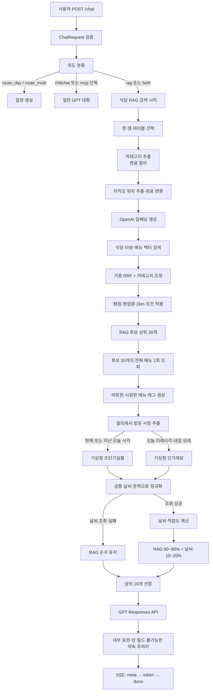
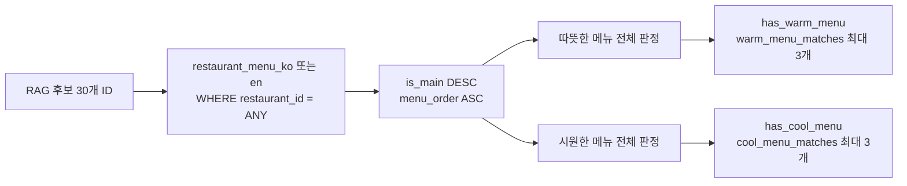
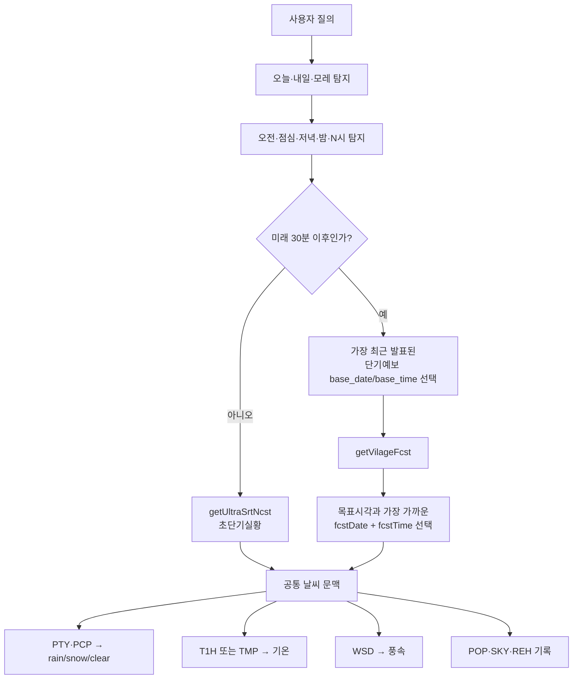
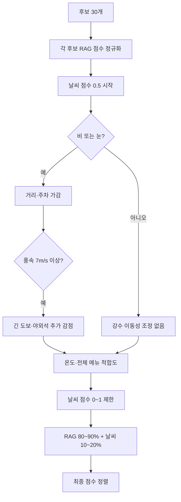

# SeoulMate 식당 RAG·날씨 재랭킹 전체 로직 설명서

## 1. 목적과 범위

이 문서는 사용자의 자연어 요청을 받아 다음 결과를 만드는 현재 백엔드 로직을 설명한다.

```text
사용자 질의
→ 의도·언어·카테고리·위치·방문시점 분석
→ PostgreSQL/pgvector 식당 후보 30개 검색
→ 후보 전체 메뉴로 날씨 메뉴 태그 생성
→ 방문시점의 기상청 실황 또는 예보 조회
→ RAG 관련성을 보존하며 날씨로 재랭킹
→ 상위 10개를 GPT에 전달
→ 최대 3곳 추천 답변을 SSE로 전송
```

설명의 기준 코드는 다음과 같다.

- `routers/chat.py`: 전체 요청 흐름과 SSE 응답
- `services/intent.py`: 의도 분류
- `services/rag.py`: 위치·카테고리·벡터 검색·후보 보강
- `services/weather.py`: 시간 해석과 기상청 실황·예보
- `services/weather_reranker.py`: 날씨 점수와 최종 순위
- `services/llm.py`: GPT 입력·답변 제약·후처리

---

## 2. 전체 순서도



---

## 3. `/chat` 요청과 의도 분류

### 3.1 주요 요청 필드

| 필드 | 의미 | 기본값 |
|---|---|---|
| `message` | 사용자 자연어 질의 | 필수 |
| `lang` | `ko`, `en` 등 응답 언어 | `en` |
| `history` | 이전 대화 | 빈 목록 |
| `lat`, `lng` | 사용자가 제공한 중심 좌표 | 없음 |
| `min_rating` | 최소 평점 | 없음 |
| `open_now` | 현재 영업 중 필터 | `false` |

### 3.2 의도 우선순위

```text
route_multi
→ route_day
→ rag + mcp = both
→ mcp
→ rag
→ chitchat
```

식당 추천 관련 단어와 시간·날씨 단어가 함께 있으면 `both`로 분류한다.

예시:

| 질의 | 판정 |
|---|---|
| `강남역 한식당 추천` | `rag` |
| `내일 가기 좋은 곳` | `both` |
| `오늘 저녁에 갈 식당 추천` | `both` |
| `비 오는 날 데이트 맛집` | `both` |

`rag`와 `both`는 동일한 식당 RAG·날씨 파이프라인으로 진입한다. 일정 관련 의도는 현재 안내 응답만 반환한다.

---

## 4. RAG 후보 30개 생성

### 4.1 언어별 테이블

한글과 영문 데이터를 섞지 않고 별도 테이블로 검색한다.

| 데이터 | 한글 | 영문 |
|---|---|---|
| 식당 | `restaurant_ko` | `restaurant_en` |
| 메뉴 | `restaurant_menu_ko` | `restaurant_menu_en` |
| 리뷰 | `restaurant_review_ko` | `restaurant_review_en` |
| 식당 임베딩 | `restaurant_embedding_ko` | `restaurant_embedding_en` |
| 메뉴 임베딩 | `menu_embedding_ko` | `menu_embedding_en` |
| 리뷰 임베딩 | `review_embedding_ko` | `review_embedding_en` |

### 4.2 카테고리 추출

한글 질의에서 `한식당`, `일식`, `라멘`, `고깃집`, `카페` 등의 표현을 표준 카테고리로 변환한다.

```text
"홍대입구역 근처 데이트하기 좋은 일식당"
→ 카테고리: 일본 요리
→ 카테고리를 제거한 의미 검색 문장: "데이트하기 좋은"
```

정확 일치를 먼저 사용하며, 길이가 충분한 키워드만 제한적으로 퍼지 매칭한다. `바나나`가 짧은 키워드 `바`와 매칭되는 식의 오탐을 방지한다.

### 4.3 위치 추출

`역`, `구`, `동`, `공원`, `시장`, `대학교` 등의 접미사를 가진 구문을 위치 후보로 만든다.

```text
"홍대입구역 근처 일식당"
→ Kakao Local API
→ 홍대입구역 2호선
→ 위도·경도
→ 반경 2km 식당 ID 목록
```

카카오 키가 없거나 위치를 찾지 못하면 반경 필터 없이 검색한다. 날씨 좌표는 요청 좌표가 있으면 그것을 사용하고, 없으면 서울 중심 좌표를 사용한다.

### 4.4 임베딩 검색

- 모델 기본값: `text-embedding-3-large`
- 저장·요청 차원 기본값: `1536`
- 원문 질의 벡터: 식당 및 메뉴 검색
- 위치·카테고리를 제거한 의미 질의 벡터: 리뷰 검색

검색 상한:

| 검색 대상 | 검색 상한 |
|---|---:|
| 식당 임베딩 | 100 |
| 리뷰 임베딩 | 250 |
| 메뉴 임베딩 | 250 |

### 4.5 가중 RRF 점수

기본 상수는 `RRF_K = 60`이다.

```text
식당 점수 = 0.7 / (60 + 식당 rank)

리뷰 점수 = 2.0 × Σ(리뷰 길이 계수 / (60 + 리뷰 rank))

메뉴 점수 = 0.5 × Σ(대표메뉴 계수 / (60 + 메뉴 rank))
```

리뷰 길이 계수:

| 단어 수 | 계수 |
|---:|---:|
| 3단어 이하 | 0.3 |
| 4~6단어 | 0.8 |
| 7단어 이상 | 1.0 |

메뉴 계수:

| 메뉴 | 계수 |
|---|---:|
| `is_main=true` | 1.0 |
| `is_main=false` | 0.4 |

리뷰와 메뉴는 cosine similarity가 `0.15` 이상인 결과만 사용하고 식당별 상위 3개를 RRF 근거로 남긴다.

### 4.6 카테고리 조정

```text
카테고리 일치: 기본 RRF 점수의 +20%
카테고리 불일치: 기본 RRF 점수의 -80%
카테고리 정보 없음: 조정 없음
```

카카오 카테고리가 다른 음식군으로 명확하면 혼합 원본 태그보다 우선한다. 예를 들어 원본 태그에 `한국`이 섞여 있어도 카카오 분류가 `중국요리`면 한식 질의에서 불일치로 처리한다.

### 4.7 일반 필터와 거리

- `min_rating`이 있으면 최소 평점 적용
- `open_now=true`면 영업시간 문자열을 파싱해 폐점 식당 제외
- 위치가 있으면 기본 반경 2km
- 최종 RAG 점수, 리뷰 수, 식당 ID 순으로 안정 정렬
- 상위 30개 확정

---

## 5. 후보 전체 메뉴 날씨 태그

RRF의 `evidence.menus`는 질의와 유사한 메뉴 최대 3개일 뿐 식당의 전체 메뉴가 아니다. 날씨 메뉴 판정은 후보 30개가 확정된 뒤 메뉴 테이블을 한 번 더 조회해 전체 메뉴로 계산한다.



대표 키워드:

- 따뜻한 메뉴: 찌개, 전골, 국밥, 라멘, 우동, 칼국수, 닭한마리, 해장국, 북어국, 떡국, 육개장 등
- 시원한 메뉴: 냉면, 콩국수, 빙수, 아이스크림, 냉모밀, 냉라면, 샐러드, 초계탕 등

오탐 방지:

- `탕수육`, `탕후루`, `무설탕`은 따뜻한 국물 `탕`에서 제외
- `초계탕`은 따뜻한 탕이 아니라 시원한 메뉴
- `불고기샐러드피자`처럼 샐러드가 피자명 일부인 경우 시원한 샐러드에서 제외

---

## 6. 방문 시점 해석

### 6.1 시간 해석 규칙

| 사용자 표현 | 적용 시각 |
|---|---|
| 시간 표현 없음 | 현재 |
| 오늘 저녁 | 오늘 19:00 |
| 오늘 저녁 7시 | 오늘 19:00 |
| 오늘 밤 9시 | 오늘 21:00 |
| 내일 점심 | 내일 12:00 |
| 내일 저녁 | 내일 19:00 |
| 내일 | 내일 19:00, 기본값임을 표시 |
| 모레 | 모레 19:00, 기본값임을 표시 |

이미 지난 오늘 시각이면 과거 예보를 사용하지 않고 현재 실황으로 전환한다.

영문은 `today`, `tonight`, `tomorrow`, `morning`, `lunch`, `dinner`, `9 pm` 등을 처리한다.

### 6.2 시간·날씨 선택 순서도



---

## 7. 기상청 데이터 정규화

### 7.1 현재 실황

API: `getUltraSrtNcst`

| 원본 필드 | 내부 필드 |
|---|---|
| `PTY` | `condition` |
| `RN1` | `rainfall_mm` |
| `T1H` | `temperature_c` |
| `WSD` | `wind_speed_mps` |
| `REH` | `humidity_pct` |

### 7.2 미래 단기예보

API: `getVilageFcst`

| 원본 필드 | 내부 필드 |
|---|---|
| `PTY`, `PCP` | `condition`, `rainfall_mm` |
| `TMP` | `temperature_c` |
| `WSD` | `wind_speed_mps` |
| `POP` | `precipitation_probability_pct` |
| `SKY` | `sky` |
| `REH` | `humidity_pct` |

공통 부가 필드:

```json
{
  "available": true,
  "is_forecast": true,
  "target_label": "내일 저녁(기본 19시)",
  "forecast_for": "2026-07-14T19:00:00+09:00",
  "source": "KMA-vilage-forecast"
}
```

현재 실황과 단기예보 모두 격자·발표시각·목표시각 기준으로 10분 캐시한다.

---

## 8. 날씨 재랭킹 점수

### 8.1 야외석 판정

`description`과 `description_kakao`에서 강한 표현만 사용한다.

```text
루프탑, 테라스, 야외석, 야외 좌석, 야외 테이블
```

일치하면 `high`, 없으면 `unknown`이다. `정원`, `가든`, `뷰`, `통창`은 실제 야외석이 아닐 수 있어 사용하지 않는다. 리뷰 기반 야외 판정도 v1에서는 사용하지 않는다.

### 8.2 날씨 적합도

모든 후보는 중립값 `0.5`에서 시작한다.

| 조건 | 날씨 점수 변화 |
|---|---:|
| 비·눈 + 거리 500m 이내 | `+0.12` |
| 비·눈 + 거리 1km 이내 | `+0.07` |
| 비·눈 + 거리 1.5km 이상 | `-0.05` |
| 비·눈 + 주차 가능 `true` | `+0.10` |
| 비·눈 + 풍속 7m/s 이상 + 거리 1km 이상 | `-0.07` |
| 비·눈 + 확실한 야외석 | `-0.15` |
| 비·눈 + 풍속 7m/s 이상 + 확실한 야외석 | 추가 `-0.08` |
| 기온 28°C 이상 + 시원한 메뉴 | `+0.15` |
| 기온 5°C 미만 + 따뜻한 메뉴 | `+0.15` |

계산 후 `0.0~1.0` 범위로 제한한다.

`has_parking=false`와 `null`은 모두 중립이다. 주차 데이터가 없다는 사실을 주차 불가로 해석하지 않는다.

### 8.3 최종 점수

먼저 후보별 원래 RAG 점수를 최고 RAG 점수로 나눈다.

```text
rag_normalized = candidate_rag_score / highest_rag_score
```

그다음 날씨 점수를 혼합한다.

```text
final_score
= rag_normalized × (1 - weather_weight)
 + weather_score × weather_weight
```

| 질의 | `weather_weight` |
|---|---:|
| 일반 식당 질의 | 기본 `0.10` |
| 비·눈·더위·추위·오늘 저녁·내일 등 명시 | 최대 `0.20` |

날씨는 후보 제거 필터가 아니라 보조 신호다. RAG 점수 차이가 크면 날씨가 순위를 무리하게 뒤집지 않고, RAG 점수가 비슷한 후보 사이에서만 순서를 조정한다.

### 8.4 재랭킹 순서도



---

## 9. GPT 최종 답변

재랭킹 상위 10개만 OpenAI Responses API에 전달한다.

후보별 전달 정보:

- 재랭킹 순서
- 식당 ID, 이름, 카테고리, 평점, 리뷰 수
- 주소와 거리
- 실제 적용된 날씨 사유
- 현재 날씨에 실제로 적합한 메뉴만 선별한 목록
- semantic search에서 찾은 메뉴 최대 3개
- 리뷰 근거 최대 3개, 각 300자 제한

`warm_menu_matches`와 `cool_menu_matches`를 항상 보내지 않는다. 실제 기온 때문에 따뜻한·시원한 메뉴 가점이 발동한 경우에만 `weather_suitable_menus`로 전달한다. 비 오는 17°C 날씨에 우동이 있다는 이유만으로 “비에 어울리는 따뜻한 메뉴”라고 과장하는 것을 방지한다.

GPT 제약:

1. 전달된 후보 안에서 최대 3곳만 추천
2. 사용자 필수 조건을 만족하는 후보끼리는 재랭킹 순서 우선
3. 날씨 사유에 없는 장점을 주소·설명·리뷰에서 새로 추론하지 않음
4. 내부 필드명과 점수 노출 금지
5. 빈 필드 언급 금지
6. 예약·전화·지도 확인처럼 실행하지 않은 작업 약속 금지

생성 후에도 후처리로 내부 용어, 빈 필드 안내, 실행 불가능한 약속을 제거한다.

---

## 10. SSE 응답

`POST /chat`은 `text/event-stream`으로 반환한다.

```text
meta
→ token 여러 개
→ done
```

오류가 발생하면:

```text
error
```

`meta`에는 다음 정보가 포함된다.

- 상위 식당 목록
- 최종 점수
- 원래 RAG 점수
- 날씨 점수
- 날씨 사유
- 기상청 도구 결과
- 사용한 데이터 소스

---

## 11. 실패·폴백 정책

| 실패 상황 | 처리 |
|---|---|
| KMA 키 없음·API 실패 | 날씨 점수 없이 RAG 순서 유지 |
| 미래 예보 실패 | 현재 날씨로 대체하지 않음; 미래 요청을 현재 날씨로 오해하지 않도록 RAG 유지 |
| 카카오 키 없음·위치 검색 실패 | 위치 반경 필터 없이 검색 |
| 후보 0개 | 조건 완화 안내 |
| GPT 호출 실패 | SSE `error` 이벤트 |
| 주차 정보 `null` | 감점하지 않음 |
| 야외석 정보 없음 | `unknown`, 감점하지 않음 |

---

## 12. API 사용 예시

### 현재 날씨

```http
GET /weather/context?lat=37.5665&lng=126.9780
```

### 질의 시점 날씨

```http
GET /weather/context?lat=37.5665&lng=126.9780&query=내일%20저녁%20갈%20식당
```

### 식당 추천

```http
POST /chat
Content-Type: application/json

{
  "message": "강남역 근처 내일 저녁에 가기 좋은 한식당 추천",
  "lang": "ko",
  "min_rating": 4.0,
  "open_now": false
}
```

---

## 13. 검증 현황

자동 테스트는 다음을 포함한다.

- 서울 위·경도 → 기상청 격자 변환
- 오늘 저녁·내일 점심·내일 기본 19시 해석
- `오늘 저녁 7시` → 19시 변환
- 지난 오늘 시각 → 현재 실황 전환
- 단기예보 발표시각 선택
- 단기예보 `TMP/PTY/POP/PCP/WSD/REH/SKY` 정규화
- 미래 식당 질의가 `both`로 분류되는지 확인
- 전체 메뉴 한·영 날씨 태그
- 탕수육·초계탕·샐러드피자 오탐 방지
- 주차 `false/null` 중립
- 비·눈·강풍·야외 감점
- 카테고리 혼합 태그 충돌
- GPT 입력에서 비활성 날씨 메뉴 제거
- GPT 내부 표현 후처리

현재 전체 테스트 수는 25개다.

실제 기상청 API 검증에서는 다음과 같이 서로 다른 목표시각이 선택됐다.

| 질의 | 선택 시각 | 결과 예시 |
|---|---|---|
| 오늘 저녁, 이미 시각 경과 | 현재 실황 | 맑음, 30.1°C |
| 내일 | 내일 19:00 | 비, 28°C, 강수확률 60%, 풍속 7.8m/s |
| 내일 점심 | 내일 12:00 | 비, 31°C, 강수확률 60%, 풍속 5.8m/s |

---

## 14. 운영 시 확인 사항

필수 환경변수:

```text
OPENAI_API_KEY
KAKAO_REST_API_KEY
KMA_API_KEY
DB_HOST
DB_PORT
DB_NAME
DB_USER
DB_PASSWORD
```

주요 조정값:

```text
WEATHER_CACHE_TTL_SECONDS=600
WEATHER_RERANK_WEIGHT=0.10
OPENAI_CHAT_MODEL=gpt-5-mini
OPENAI_EMBED_MODEL=text-embedding-3-large
OPENAI_EMBED_DIM=1536
```

날씨 가중치를 높이면 시간·날씨 적합성이 더 강하게 순위를 바꾸지만 RAG 관련성이 약한 식당이 올라올 수 있다. 기본 10%, 명시적 날씨·미래시점 질의 최대 20%를 권장한다.

---

## 15. 공식 데이터 참고

- [공공데이터포털 기상청 단기예보 조회서비스](https://www.data.go.kr/data/15084084/openapi.do)
- [공공데이터포털 기상청 단기예보 설명](https://www.data.go.kr/data/15043494/fileData.do)
