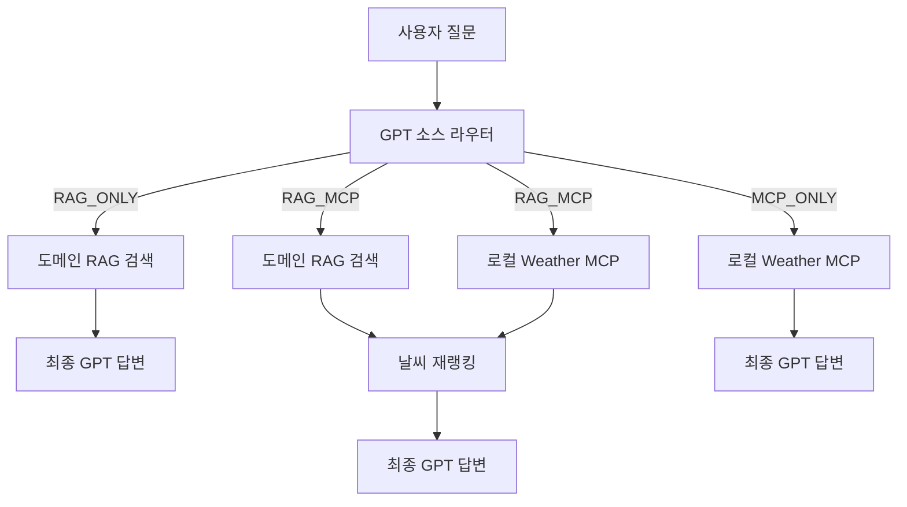

# SeoulMate Weather MCP 사용 설명서

## 1. 현재 채택한 구조

사용자 질문을 받은 첫 번째 GPT는 답변을 만들지 않고, 어떤 데이터 소스를 사용할지만 결정합니다.



데이터 사용 방식은 다음 세 가지입니다.

| 모드 | 사용 데이터 | 대표 질문 |
|---|---|---|
| `RAG_ONLY` | RAG만 사용 | `조용한 카페 추천해줘` |
| `RAG_MCP` | RAG + Weather MCP | `내일 저녁에 갈 조용한 카페 추천해줘` |
| `MCP_ONLY` | Weather MCP만 사용 | `내일 서울 날씨 알려줘` |

일상 대화는 `CHITCHAT`으로 별도 처리합니다. 이것은 위 세 데이터 소스 모드 밖의 예외 경로입니다.

중요한 원칙:

- 첫 번째 GPT는 소스 선택만 하며 사용자 답변을 작성하지 않습니다.
- `RAG_ONLY`에서는 MCP를 호출하지 않습니다.
- `MCP_ONLY`에서는 RAG를 호출하지 않으며 장소를 임의로 추천하지 않습니다.
- `RAG_MCP`에서만 날씨를 후보 재랭킹과 최종 답변 힌트에 함께 사용합니다.
- MCP 오류가 발생해도 서버 전체가 중단되지 않도록 `available=false` 결과로 안전하게 처리합니다.

## 2. 구성 파일

| 파일 | 역할 |
|---|---|
| `services/source_router.py` | 첫 번째 GPT가 `RAG_ONLY`, `RAG_MCP`, `MCP_ONLY`, `CHITCHAT` 결정 |
| `services/weather_mcp_client.py` | 백엔드에서 로컬 Weather MCP를 호출하는 공용 브리지 |
| `weather_mcp_server.py` | 팀 공용 Weather MCP 서버 |
| `kma_weather_client.py` | 기상청 API 호출, 날짜·시간·한국어·영어 해석 |
| `services/weather_reranker.py` | 도메인 후보에 날씨 보조 점수 반영 |
| `routers/chat.py` | 세 경로를 실제로 실행하는 오케스트레이터 |
| `services/llm.py` | RAG 답변, RAG+MCP 답변, MCP 전용 답변 생성 |
| `services/weather_mcp_config.py` | 향후 원격 MCP 직접 연결 시 사용할 선택 구성 |

## 3. 환경변수

백엔드 `.env`에 다음 값을 설정합니다.

```env
OPENAI_API_KEY=...
KMA_API_KEY=...
WEATHER_MCP_URL=http://127.0.0.1:8001/mcp
```

`WEATHER_MCP_BEARER_TOKEN`은 외부에 MCP를 공개할 때만 선택적으로 사용합니다. 로컬 개발 환경에서는 생략할 수 있습니다.

환경변수를 변경했다면 실행 중인 FastAPI, MCP 서버, Jupyter 커널을 모두 다시 시작해야 합니다.

## 4. 실행 방법

프로젝트의 절대 경로에서 두 프로세스를 각각 실행합니다.

### 터미널 1: Weather MCP

```powershell
Set-Location 'C:\Users\user\Desktop\seoulmate\SeoulMate\backend'
python weather_mcp_server.py
```

기본 주소:

- 상태 확인: `http://127.0.0.1:8001/health`
- MCP 엔드포인트: `http://127.0.0.1:8001/mcp`

### 터미널 2: SeoulMate 백엔드

```powershell
Set-Location 'C:\Users\user\Desktop\seoulmate\SeoulMate\backend'
uvicorn main:app --reload --port 8000
```

현재 방식은 백엔드가 같은 PC 또는 내부 서버의 MCP를 직접 호출합니다. 따라서 OpenAI Platform 로그인, Secure Tunnel, 공개 HTTPS URL이 없어도 동작합니다.

## 5. 도메인 팀 적용 방법

날씨 코드는 숙박·카페·문화시설 팀이 다시 작성하지 않습니다. 모든 팀이 다음 공용 계층을 사용합니다.

1. `decide_source_mode()`로 질문의 데이터 소스를 결정합니다.
2. 각 팀은 자기 도메인의 RAG 검색기만 제공합니다.
3. 날씨가 필요한 모드에서만 `get_weather_via_mcp()`를 호출합니다.
4. `RAG_MCP`이면 도메인 후보와 날씨를 해당 도메인의 재랭커에 전달합니다.
5. 최종 GPT에는 실제로 사용한 데이터만 전달합니다.

개념 코드는 다음과 같습니다.

```python
decision = await decide_source_mode(user_query)

if decision.mode == "RAG_ONLY":
    candidates = await domain_rag.search(user_query)
    return await answer_with_rag(user_query, candidates)

if decision.mode == "RAG_MCP":
    candidates = await domain_rag.search(user_query)
    weather = await get_weather_via_mcp(user_query, lat, lng)
    reranked = domain_reranker(candidates, weather)
    return await answer_with_rag_and_weather(user_query, reranked, weather)

if decision.mode == "MCP_ONLY":
    weather = await get_weather_via_mcp(user_query, lat, lng)
    return await answer_with_weather_only(user_query, weather)
```

현재 `routers/chat.py`에 연결된 RAG 실행부는 음식점 검색기입니다. 숙박·카페·문화시설은 각 팀의 기존 RAG 결과를 위 공용 오케스트레이션 인터페이스에 연결해야 합니다. 날씨 조회와 한·영 시간 해석은 그대로 재사용할 수 있습니다.

## 6. Weather MCP 입력과 출력

공용 도구 이름은 `get_weather_context`입니다.

주요 입력:

| 필드 | 설명 |
|---|---|
| `query` | `내일 저녁`, `tomorrow evening`, `3pm`, `10 am` 등의 원문 |
| `lat`, `lng` | 대상 장소 좌표 |
| `language` | `ko`, `en`, 또는 자동 판정 |
| `place_name` | 서울, 강남 등 표시용 장소명 |

주요 출력:

- 해석된 목표 날짜와 시간
- 기온, 체감 범주, 습도, 강수형태, 강수확률, 풍속, 하늘상태
- 재랭킹용 `tags`
- 최종 GPT에 전달할 `usage_guidance`
- 오류 시 `available=false`와 오류 정보

시간 표현 예시:

| 입력 | 해석 |
|---|---|
| `오늘`, `today` | 오늘 |
| `내일`, `tomorrow` | 내일 |
| `모레`, `day after tomorrow` | 모레 |
| `아침`, `morning` | 09:00 |
| `점심`, `lunch`, `noon` | 12:00 |
| `저녁`, `evening` | 19:00 |
| `밤`, `night`, `tonight` | 21:00 |
| `오후 3시`, `3pm`, `3 pm` | 15:00 |
| `오전 10시`, `10am`, `10 am` | 10:00 |

지원 예보 범위를 벗어나는 먼 미래 요청은 가능한 가장 가까운 예보 범위로 임의 변환하지 않고, 가용성 또는 신뢰도 정보를 통해 제한을 드러내야 합니다.

## 7. 최종 GPT 사용 규칙

- 기상청/MCP가 반환한 필드와 `usage_guidance`만 근거로 사용합니다.
- 비 정보가 없는데 소나기·우산·우비 등을 임의로 추가하지 않습니다.
- 장소 데이터가 없는 `MCP_ONLY`에서는 구체적인 장소를 만들어내지 않습니다.
- 날씨 점수는 필터가 아니라 보조 신호로 사용합니다. RAG 관련성이 높은 후보를 날씨만으로 제거하지 않습니다.
- 사용자에게는 날씨 때문에 순위가 바뀐 핵심 이유만 짧게 설명합니다.

## 8. 원격 MCP와 Secure Tunnel은 언제 필요한가

현재 팀이 하나의 백엔드 안에서 Weather MCP를 공유한다면 로컬 또는 내부 네트워크 MCP가 가장 단순합니다.

다음 상황이 되면 원격 MCP 배포를 검토합니다.

- 서로 다른 서버나 조직에서 같은 MCP를 호출해야 할 때
- OpenAI Responses API가 원격 MCP를 직접 호출하게 할 때
- 외부 클라이언트에 표준 MCP 엔드포인트를 제공할 때

그때는 공개 HTTPS, 인증, 호출 제한, 로그, 타임아웃, 장애 격리가 필요합니다. OpenAI Secure Tunnel은 가능한 선택지 중 하나이며 필수는 아닙니다. 현재 로컬 브리지 구조에서는 프로젝트용 `OPENAI_API_KEY`를 발급한 계정으로 Platform에 로그인하지 않아도 됩니다.

## 9. 빠른 점검

```powershell
Invoke-RestMethod http://127.0.0.1:8001/health
python -m unittest discover -s tests -v
```

확인할 테스트 질문:

- `조용한 일식당 추천해줘` → `RAG_ONLY`, MCP 호출 없음
- `내일 저녁에 갈 조용한 일식당 추천해줘` → `RAG_MCP`, RAG와 MCP 모두 호출
- `내일 서울 날씨 알려줘` → `MCP_ONLY`, RAG 호출 없음
- `숙박 추천해줘` → `RAG_ONLY`
- `비 오는 날 문화시설 추천해줘` → `RAG_MCP`
- `안녕, 오늘 기분 어때?` → `CHITCHAT`

