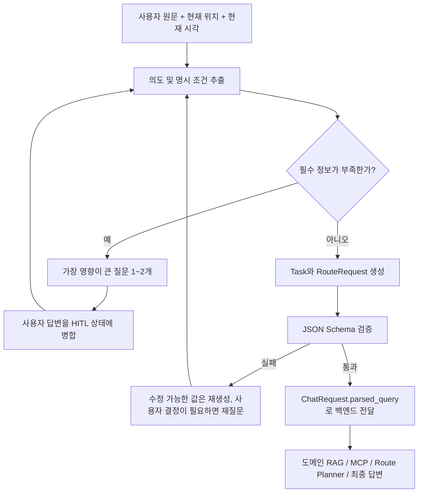

# SeoulMate 첫 GPT + Human-in-the-loop 최종 JSON 계약

> 대상: 사용자 질문을 받고 부족한 정보를 추가로 물은 뒤, 백엔드에 전달할 `StructuredTravelQuery` JSON을 만드는 팀원
>
> 기준 코드: `schemas/structured_query.py`, `schemas/route_planner.py`, `schemas/chat.py`

---

## 1. 결론

첫 GPT의 역할은 장소를 추천하는 것이 아니다.

1. 사용자 의도를 판별한다.
2. 검색과 일정 구성에 필요한 정보가 부족하면 사용자에게 짧게 질문한다.
3. 사용자의 답을 누적한다.
4. 충분한 정보가 모였을 때만 최종 `StructuredTravelQuery`를 만든다.
5. 최종 JSON은 `/chat` 요청의 `parsed_query`에 넣는다.

Human-in-the-loop 진행 상태와 백엔드 검색 JSON은 분리한다.

```text
대화 중: HITL 상태 객체 (프론트/LangGraph 내부 전용)
확정 후: StructuredTravelQuery (백엔드 전달용)
```

백엔드에 질문용 임시 JSON을 보내면 안 된다. 아직 결정되지 않은 값을 GPT가 임의로 채우는 것도 금지한다.

---

## 2. 전체 흐름



---

## 3. HITL 중간 상태 계약

이 객체는 팀원의 LangGraph/프론트에서만 사용한다. `/chat.parsed_query`로 보내지 않는다.

```json
{
  "status": "collecting",
  "assistant_message": "당일에 몇 곳 정도 방문하고 싶으세요?",
  "missing_fields": ["route_request.target_places_per_day"],
  "collected": {
    "original_question": "내일 홍대 하루 코스 짜줘",
    "language": "ko",
    "intent": "day_trip_route",
    "location": "홍대",
    "start_date": "2026-07-16"
  },
  "structured_query": null
}
```

확정 시에는 다음처럼 바꾼다.

```json
{
  "status": "ready",
  "assistant_message": null,
  "missing_fields": [],
  "collected": {},
  "structured_query": { "...": "최종 StructuredTravelQuery" }
}
```

`status`, `assistant_message`, `missing_fields`, `collected`는 오케스트레이터용이다. 백엔드에는 `structured_query` 내부만 전달한다.

---

## 4. 백엔드 전달 최종 JSON

```json
{
  "language": "ko",
  "intent": "single_place_recommendation",
  "original_question": "홍대에서 조용한 한식당 추천해줘",
  "normalized_question": "홍대 조용한 한식당 추천",
  "tasks": [
    {
      "task_id": "task_1",
      "domain": "restaurant",
      "search_query": "홍대 조용한 한식당",
      "themes": ["조용한"],
      "desired_count": 3,
      "notes": null,
      "slot_id": null,
      "day_number": null,
      "visit_date": null,
      "start_time": null,
      "end_date": null,
      "end_time": null,
      "filters": null
    }
  ],
  "filters": {
    "location": "홍대",
    "radius_km": null,
    "is_active": true,
    "start_date": null,
    "end_date": null,
    "time_window": null,
    "party_size": null,
    "budget_min_krw": null,
    "budget_max_krw": null,
    "transportation": [],
    "accessibility": [],
    "required_features": [],
    "excluded_features": []
  },
  "source_mode": null,
  "weather_request": null,
  "route_request": null,
  "general_response_instruction": null
}
```

### 최상위 필드

| 필드 | 필수 | 규칙 |
|---|---:|---|
| `language` | O | 사용자 답변 언어. 기본 `ko`; 영어는 `en` |
| `intent` | O | 아래 허용값 중 하나 |
| `original_question` | O | 첫 원문을 훼손하지 않고 보존 |
| `normalized_question` | O | 확정된 사용자 답까지 반영한 간결한 검색 목적 문장 |
| `tasks` | O | 장소 검색 단위. 검색하지 않는 의도는 빈 배열 |
| `filters` | O | 모든 Task에 공통인 조건 |
| `source_mode` | 선택 | `null`/생략 권장. 백엔드가 날짜·의도에 따라 계산 |
| `weather_request` | 조건부 | 날씨 조회가 필요한 경우 |
| `route_request` | 조건부 | 당일·다일 루트 생성 시 필수 |
| `general_response_instruction` | 조건부 | `general_response`에서만 사용 |

### intent 허용값

| intent | 의미 | Task |
|---|---|---|
| `single_place_recommendation` | 도메인별 장소 선택지 추천 | 도메인마다 생성 |
| `day_trip_route` | 당일 방문 루트 | 장소 슬롯마다 생성 |
| `multi_day_route` | 1박 이상 루트 | 날짜·장소 슬롯마다 생성 |
| `weather_information` | 날씨만 질문 | 빈 배열 |
| `general_response` | 여행 검색이 아닌 일반 답변 | 빈 배열 |

---

## 5. Task 계약

```json
{
  "task_id": "task_1",
  "domain": "restaurant",
  "search_query": "홍대 조용한 한식당",
  "themes": ["조용한", "한식"],
  "desired_count": 3,
  "notes": null,
  "slot_id": null,
  "day_number": null,
  "visit_date": null,
  "start_time": null,
  "end_date": null,
  "end_time": null,
  "filters": null
}
```

| 필드 | 규칙 |
|---|---|
| `task_id` | 요청 안에서 유일한 안정적 ID. `task_1`, `task_2` 권장 |
| `domain` | `restaurant`, `cafe`, `accommodation`, `attraction`, `etc` 중 하나 |
| `search_query` | 장소 DB에서 찾을 내용만. 날씨 문구나 다른 Task의 조건을 섞지 않음 |
| `themes` | 분위기·음식군·활동 등 의미 검색 힌트 |
| `desired_count` | 단일 추천은 최종 3개 선택지 정책. 루트는 슬롯당 `1` |
| `notes` | 검색보다 일정 조합에 도움이 되는 자유 메모 |
| `slot_id` | 루트에서 고유 슬롯 ID. `d1-restaurant-1` 형식 권장 |
| `day_number` | 루트 일차. 1부터 시작 |
| `visit_date` | 해당 슬롯 방문일 |
| `start_time`, `end_time` | `HH:MM` 24시간 형식 |
| `end_date` | 숙박처럼 날짜를 넘길 때 사용 |
| `filters` | 이 Task만 다른 조건을 가질 때 사용; 아니면 `null` |

중요 규칙:

- Task는 도메인별이 아니라 **검색 목적 또는 방문 슬롯별**이다.
- 같은 날 식당 2곳이면 restaurant Task도 2개다.
- 식당과 카페를 함께 요청하면 각각 별도 Task다.
- 날씨는 장소가 아니므로 `domain: weather` Task를 만들지 않는다.
- 공통 지역은 최상위 `filters.location`, 서로 다른 지역은 `task.filters.location`에 둔다.

---

## 6. 단일 추천 규칙

제품 정책상 최종 사용자에게 항상 3개 선택지를 보여준다.

```json
{
  "language": "ko",
  "intent": "single_place_recommendation",
  "original_question": "성수에서 조용한 카페 한 곳 추천해줘",
  "normalized_question": "성수 조용한 카페 추천",
  "tasks": [
    {
      "task_id": "task_1",
      "domain": "cafe",
      "search_query": "성수 조용한 카페",
      "themes": ["조용한"],
      "desired_count": 3,
      "notes": null,
      "filters": null
    }
  ],
  "filters": { "location": "성수", "is_active": true },
  "source_mode": null,
  "weather_request": null,
  "route_request": null,
  "general_response_instruction": null
}
```

사용자가 “한 곳”이라고 말해도 백엔드는 `desired_count`를 3으로 보정한다. 팀원 GPT도 처음부터 3으로 출력하는 것이 디버깅에 더 명확하다.

---

## 7. 당일 루트: 2곳과 5곳을 구분하는 방법

`max_places_per_day`는 상한이고, `target_places_per_day`가 실제 목표다.

```text
Task 개수 = 실제 방문 장소 수
target_places_per_day = 사용자가 합의한 정확한 장소 수
max_places_per_day = 시스템이 허용하는 최대치
```

### 저녁 식당 + 카페 미니 루트

```json
{
  "language": "ko",
  "intent": "day_trip_route",
  "original_question": "내일 홍대에서 저녁을 먹고 분위기 좋은 카페도 가고 싶어",
  "normalized_question": "2026-07-16 홍대 저녁 식사 후 분위기 좋은 카페 방문",
  "tasks": [
    {
      "task_id": "task_1",
      "domain": "restaurant",
      "search_query": "홍대 저녁 식사",
      "themes": ["저녁", "식사"],
      "desired_count": 1,
      "slot_id": "d1-restaurant-1",
      "day_number": 1,
      "visit_date": "2026-07-16",
      "start_time": "19:00",
      "end_time": "20:30",
      "filters": null
    },
    {
      "task_id": "task_2",
      "domain": "cafe",
      "search_query": "홍대 분위기 좋은 카페",
      "themes": ["분위기 좋은"],
      "desired_count": 1,
      "slot_id": "d1-cafe-1",
      "day_number": 1,
      "visit_date": "2026-07-16",
      "start_time": "21:00",
      "end_time": "22:00",
      "filters": null
    }
  ],
  "filters": {
    "location": "홍대",
    "start_date": "2026-07-16",
    "end_date": "2026-07-16",
    "is_active": true
  },
  "route_request": {
    "destination": "홍대",
    "period": {
      "start_date": "2026-07-16",
      "end_date": "2026-07-16",
      "nights": 0,
      "days": 1
    },
    "pace": "normal",
    "max_places_per_day": 5,
    "target_places_per_day": 2,
    "preferred_areas": ["홍대"],
    "preferred_themes": ["분위기 좋은"]
  },
  "source_mode": null,
  "weather_request": {
    "query": "내일 홍대에서 저녁을 먹고 분위기 좋은 카페도 가고 싶어",
    "location_name": "홍대",
    "target_date": "2026-07-16",
    "target_time": "19:00",
    "language": "ko"
  },
  "general_response_instruction": null
}
```

### 하루 5곳 전체 루트

- `tasks`를 실제 방문 순서 후보에 맞춰 5개 만든다.
- 모든 Task의 `desired_count`는 1이다.
- `route_request.target_places_per_day`는 5다.
- 예: 명소 → 점심 → 명소 → 카페 → 저녁.

당일 루트에서 `target_places_per_day`가 있으면 백엔드는 Task 수와 정확히 같은지 검사한다. 5를 적고 Task를 2개만 보내면 요청을 거부한다.

사용자가 장소 수를 말하지 않은 일반 “하루 코스”라면 반드시 한 번 묻는다.

> 하루에 몇 곳 정도 둘러보고 싶으세요? 여유롭게 3곳, 보통 4곳, 알차게 5곳 중에서 골라주세요.

응답 매핑 권장:

| 사용자 선택 | `pace` | `target_places_per_day` |
|---|---|---:|
| 여유롭게 | `relaxed` | 3 |
| 보통 | `normal` | 4 |
| 알차게 | `packed` | 5 |

단, 사용자가 “저녁과 카페만”처럼 방문 종류를 명시했다면 다시 3/4/5를 묻지 않고 2곳으로 확정한다.

---

## 8. 다일 루트 규칙

다일 루트는 `target_places_per_day`를 정확한 전체 검증값으로 사용하지 않는다. 날짜별 Task 수가 다를 수 있기 때문이다.

- `period.days`와 날짜 범위가 일치해야 한다.
- `nights = days - 1`이어야 한다.
- Task마다 `day_number`, `visit_date`, `slot_id`를 넣는 것을 권장한다.
- 하루 최대 5개 Task, 전체 최대 35개 Task다.
- 숙박 슬롯은 `end_date`와 `end_time`을 넣는다.
- 도착일과 출발일은 시간 때문에 장소 수가 적을 수 있다.
- 여행 전체를 한 번에 확정하기 전에 날짜, 인원, 숙박 포함 여부, 하루 강도를 확인한다.

`route_request` 핵심 예시:

```json
{
  "destination": "서울",
  "period": {
    "start_date": "2026-08-01",
    "end_date": "2026-08-02",
    "nights": 1,
    "days": 2
  },
  "adults": 2,
  "children": 0,
  "arrival_at": "10:00",
  "arrival_location": "서울역",
  "departure_at": "20:00",
  "departure_location": "서울역",
  "pace": "normal",
  "max_places_per_day": 5,
  "target_places_per_day": null,
  "transportation": ["지하철"],
  "preferred_areas": ["홍대", "성수"],
  "preferred_themes": ["맛집", "전시"],
  "required_features": [],
  "excluded_features": [],
  "must_visit": [],
  "avoid_places": []
}
```

---

## 9. 추가 질문 판단표

### 반드시 물어야 하는 경우

| 상황 | 필수 확인 |
|---|---|
| 장소 추천인데 지역을 알 수 없음 | 검색 지역 또는 현재 위치 사용 동의 |
| 당일 루트인데 방문 종류와 개수가 모두 없음 | 목표 장소 수/강도 |
| 다일 루트인데 날짜 또는 기간이 없음 | 시작일과 종료일 또는 박·일 |
| 상대 날짜가 기준 시각 없이 모호함 | 절대 날짜 확인 |
| 루트인데 목적지가 없음 | 목적 지역 |
| 예산 표현이 애매한데 결과를 크게 바꿈 | 1인 기준인지 전체 기준인지 |

### 묻지 않고 기본값을 써도 되는 경우

| 필드 | 기본 처리 |
|---|---|
| `language` | 사용자 원문 언어 |
| `adults` | 인원 언급이 없으면 1 |
| `children` | 언급이 없으면 0 |
| `pace` | 단일/미니 루트는 `normal`; 전체 루트는 장소 수 질문 권장 |
| `is_active` | 장소 추천은 `true` |
| 빈 선호 목록 | `[]` |
| 알 수 없는 선택 필드 | `null` |

질문은 한 턴에 최대 2개가 좋다. 가장 결과를 크게 바꾸는 항목부터 묻는다.

```text
1순위: 날짜·지역·여행 기간
2순위: 방문 슬롯 수·도메인
3순위: 인원·예산·교통·필수 조건
4순위: 취향 세분화
```

---

## 10. 사용자 답변 병합 규칙

1. 새 답변은 기존에 명시되지 않은 값만 채운다.
2. 사용자가 이전 값을 명시적으로 바꾸면 최신 값을 우선한다.
3. 원문과 사용자 추가 답변을 대화 기록으로 보존한다.
4. `normalized_question`은 최종 합의 내용을 반영해 다시 만든다.
5. 날짜는 `Asia/Seoul` 기준 `YYYY-MM-DD`로 확정한다.
6. 시간은 `HH:MM` 24시간제로 변환한다.
7. “근처”는 현재 좌표가 있을 때만 좌표와 `radius_km`로 바꾼다.
8. 값이 없다는 사실과 사용자가 원하지 않는다는 사실을 구분한다. 모름은 `null`, 명시적 제외는 `excluded_features`에 넣는다.

---

## 11. 날씨와 source_mode

GPT가 `source_mode`를 억지로 결정할 필요는 없다. `null` 또는 생략하면 백엔드 정책이 결정한다.

```text
날짜 없는 장소 추천 → rag_only
오늘/내일/미래 시점이 있는 장소 추천·루트 → rag_mcp
날씨만 질문 → mcp_only
```

날씨가 필요한 경우 `weather_request`를 구성하되 장소 Task에 날씨 표현을 섞지 않는다.

```json
{
  "query": "내일 오후 3시 성수 카페 추천",
  "location_name": "성수",
  "target_date": "2026-07-16",
  "target_time": "15:00",
  "language": "ko"
}
```

루트에 시간대가 여러 개면 각 Task의 `visit_date`와 `start_time`이 실제 날씨 조회·재랭킹 기준이 된다.

---

## 12. 루트 편집 책임

기존 루트의 장소 삭제와 새 장소 삽입은 첫 GPT의 역할이 아니다. 프론트에서
현재 Zustand 루트를 직접 편집하며, 새 장소가 필요하면 단일 장소 추천을 호출한다.

---

## 13. API 전달 형태

```json
{
  "message": "내일 홍대에서 저녁 먹고 카페도 가고 싶어",
  "lang": "ko",
  "lat": 37.5563,
  "lng": 126.9236,
  "location_name": "홍대",
  "parsed_intent": "day_trip_route",
  "source_mode": null,
  "parsed_query": { "...": "확정된 StructuredTravelQuery" }
}
```

`parsed_intent`는 `parsed_query.intent`와 같아야 한다. `source_mode`는 생략해도 된다.

---

## 14. 구현 권장 상태 머신

```text
START
  → EXTRACT
  → CHECK_REQUIRED
      → ASK_USER
      → MERGE_ANSWER
      → CHECK_REQUIRED
  → BUILD_TASKS
  → BUILD_ROUTE_REQUEST (루트일 때)
  → VALIDATE_SCHEMA
      → REPAIR_ONCE (형식 오류만)
      → ASK_USER (의미 결정이 필요할 때)
  → READY
```

형식 오류와 사용자 결정 부족을 구분한다.

- 날짜 문자열 형식, 중복 task_id: GPT가 한 번 자체 수정 가능
- 여행 날짜, 목표 장소 수, 목적 지역: 사용자에게 질문
- 스키마 재생성은 최대 1회; 반복 실패 시 오류 로그와 함께 중단

---

## 15. 최종 검증 체크리스트

- [ ] `intent`가 사용자 목적과 일치한다.
- [ ] `original_question`이 그대로 보존됐다.
- [ ] 모든 `task_id`와 루트 `slot_id`가 중복되지 않는다.
- [ ] Task별 `search_query`에 다른 도메인의 조건이 섞이지 않았다.
- [ ] 단일 추천 Task의 `desired_count`는 3이다.
- [ ] 루트 Task의 `desired_count`는 1이다.
- [ ] 당일 루트의 Task 수와 `target_places_per_day`가 같다.
- [ ] `max_places_per_day`는 5 이하이고 target보다 작지 않다.
- [ ] 다일 루트의 `days`, `nights`, 날짜 범위가 일치한다.
- [ ] `day_number`와 `visit_date`가 일치한다.
- [ ] 모든 시간은 `HH:MM`이다.
- [ ] 공통 필터와 Task별 필터가 올바르게 분리됐다.
- [ ] 모르는 값을 추측하지 않고 `null`/`[]`로 남겼다.
- [ ] 날씨를 장소 Task로 만들지 않았다.
- [ ] 기존 루트의 삭제·삽입은 GPT JSON이 아니라 프론트 Zustand에서 처리한다.
- [ ] 최종 Pydantic/JSON Schema 검증을 통과한 뒤에만 백엔드로 보낸다.

---

## 16. 백엔드 검증 기준

최종 JSON은 Python에서 아래와 동일한 검증을 통과해야 한다.

```python
from schemas.structured_query import StructuredTravelQuery

validated = StructuredTravelQuery.model_validate(gpt_json)
payload = validated.model_dump(mode="json")
```

팀원이 다른 언어/프레임워크를 사용한다면 백엔드가 제공하는 JSON Schema를 공유해 같은 계약으로 검증한다. 프론트 타입을 수작업으로 별도 관리하지 말고 이 스키마에서 생성하는 방식을 권장한다.
