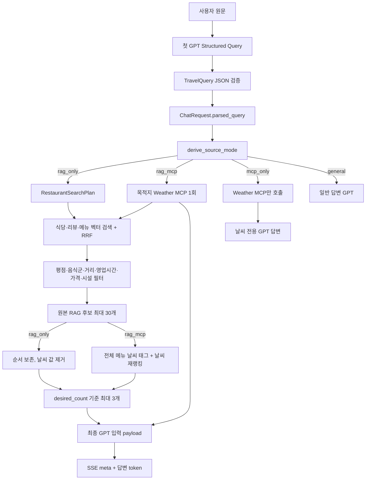

# Structured Query JSON → RAG → Weather MCP → 최종 답변 데이터 흐름

이 문서는 첫 GPT가 만든 JSON이 SeoulMate 백엔드에서 어떤 변수명으로 바뀌고, 각 필드가 RAG·MCP·최종 답변의 어느 단계에서 사용되는지 설명한다.

## 1. 같은 데이터의 변수명 변화

| 단계 | 변수/타입 | 의미 |
|---|---|---|
| 상위 LangGraph 노트북 | `state["parsed_query"]: TravelQuery` | 첫 GPT 응답 JSON을 검증한 결과 |
| `/chat` 요청 | `ChatRequest.parsed_query` | 위 객체를 JSON으로 직렬화해 백엔드에 전달한 값 |
| 백엔드 라우터 | `parsed` 또는 `body.parsed_query: StructuredTravelQuery` | 백엔드 Pydantic 스키마로 다시 검증된 값 |
| 실행 모드 | `canonical_mode` / `selected_mode` | `rag_only`, `rag_mcp`, `mcp_only`, `general` 중 하나 |
| 식당 검색 계획 | `plan: StructuredRestaurantSearchPlan` | JSON을 DB 검색에 필요한 값으로 정규화한 결과 |
| RAG 결과 | `rag_result["candidates"]` | 원본 RRF 순위 후보 최대 30개 |
| MCP 결과 | `weather` | 목적지·방문시각 기준 날씨 구조체 |
| 재랭킹 결과 | `candidates` | RAG 순위에 날씨 보조점수를 적용한 후보 |
| 최종 답변 후보 | `shortlisted` | `desired_count`를 반영한 최대 3개 후보 |
| 최종 GPT 입력 | `input_payload` | 사용자 질문, 구조화 요청, 후보 근거, 선택적 날씨 |

## 2. 전체 실행 흐름



## 3. 루트 JSON 필드

| JSON 필드 | RAG | MCP | 최종 답변 | 실제 동작 |
|---|---|---|---|---|
| `language` | `restaurant_ko/en`, 리뷰·메뉴 테이블 선택 | MCP 표시 언어 | 최종 GPT 답변 언어 | `en*`이면 영어, 그 외는 한국어로 정규화한다. |
| `intent` | 단일 추천/일정 분기 | `weather_information`이면 MCP-only | 일반/추천/일정 답변 분기 | `multi_day_route`, `day_trip_route`, `single_place_recommendation`, `weather_information`, `general_response`를 API intent로 변환한다. |
| `source_mode` | 있으면 그대로 실행 모드로 사용 | MCP 호출 여부 결정 | 날씨 payload 포함 여부 결정 | 없으면 날짜·날씨 신호·Task 유무로 코드가 파생한다. |
| `original_question` | 반경·시간·예산·평점·현재 영업의 명시 여부 확인 | `weather_request`가 없을 때 MCP query | `user_query`로 전달 | GPT가 만든 숫자 필터를 무조건 신뢰하지 않기 위한 원문 근거이기도 하다. |
| `normalized_question` | source mode 파생의 보조 텍스트 | 직접 사용하지 않음 | `structured_request`에 전달 | 최종 GPT가 정규화된 요청 목적을 함께 볼 수 있다. |
| `tasks` | Domain Registry를 통한 도메인별 검색 실행 | RAG+MCP 여부에 간접 영향 | 선택한 Task를 전달 | 식당은 실제 RAG, 나머지는 등록된 팀 검색기를 사용하며 미구현 스켈레톤만 명시적 mock을 사용한다. |
| `filters` | 위치·시간·가격·시설 하드 필터 | 목적지의 1순위 위치 | 전체 필터를 `structured_request.filters`로 전달 | 아래 필드별 설명 참고. |
| `weather_request` | 날씨 메뉴 feature 로딩 여부에 간접 영향 | query·location fallback·target date/time 사용 | 정규화된 `weather` 결과로 전달 | 구조화 날짜·시간은 자연어 query보다 우선한다. |
| `general_response_instruction` | 미사용 | 미사용 | 일반 답변 GPT의 보조 입력 | 시스템 지시가 아니라 상위 파서가 만든 응답 목적 힌트로만 취급한다. |

## 4. `tasks[]` 필드

| 필드 | 사용 위치 | 동작 |
|---|---|---|
| `task_id` | 검색 결과 추적, mock ID | 도메인 Agent와 결과를 연결한다. |
| `domain` | Agent 분기 | `restaurant`만 실제 검색, `cafe/accommodation/attraction/etc`는 임시 고정 후보다. |
| `search_query` | 임베딩 입력의 기본 문장 | 위치와 평점 표현을 제거한 후 식당·메뉴 검색에 쓴다. |
| `themes` | 임베딩·리뷰 query | `search_query`에 없는 분위기·목적 조건을 추가한다. |
| `desired_count` | 검색 `top_n` 하한, 최종 후보 수 | 최종 답변은 서비스 정책에 따라 최대 3개다. `1`이면 최종 GPT에도 1개만 전달한다. |
| `notes` | 임베딩 query | 추가 검색 의미로 붙는다. 운영 명령이 아니라 검색 텍스트로만 쓴다. |

## 5. `filters` 필드

| 필드 | RAG에서의 사용 | MCP/답변에서의 사용 |
|---|---|---|
| `location` | 지오코딩 후 기본 2km 반경 후보 생성 | 날씨 목적지 1순위, 최종 구조화 필터 |
| `radius_km` | 원문에 km가 명시된 경우만 신뢰, 아니면 2km | 최종 구조화 필터 |
| `is_active` | `true`이고 원문에 `지금/현재/now`가 있을 때만 현재 영업 하드 필터 | 확인 근거가 있을 때만 최종 GPT에 영업 상태 전달 |
| `start_date` | `time_window`와 합쳐 방문시각 영업 판정, source mode 파생 | route 시작일, 날씨는 `weather_request.target_date` 우선 |
| `end_date` | source mode 파생 | route 일수 계산. 현재 multi-day 실제 배치는 미구현 |
| `time_window` | 원문에 시간 표현이 있을 때만 방문시각으로 변환 | 최종 구조화 필터 |
| `party_size` | 현재 하드 필터에는 사용하지 않음 | 최종 GPT에 전달. 단체석 정보가 희소해 자동 탈락시키지 않는다. |
| `budget_min_krw/max` | 원문에 실제 금액이 있을 때만 `menu_price_median` 하드 필터 | 최종 GPT에 전달. 정확한 1인 비용으로 단정하지 않는다. |
| `transportation` | 현재 `주차/parking`처럼 DB 필드로 매핑 가능한 값만 사용 | 전체 값은 최종 GPT에 전달 |
| `accessibility` | 휠체어·무장애를 `has_disabled_access`로 매핑 | 전체 값은 최종 GPT에 전달 |
| `required_features` | 확인값이 `true`인 후보만 통과 | 최종 GPT에 전달 |
| `excluded_features` | 확인값이 `true`인 후보를 제외. `false/unknown`은 유지 | 최종 GPT에 전달 |

백엔드는 `start_date <= end_date`, `budget_min <= budget_max`를 다시 검증한다.

## 6. `weather_request` 필드

| 필드 | 사용 방식 |
|---|---|
| `query` | MCP의 자연어 시간 해석 fallback. 구조화 날짜가 없을 때 전체 질문으로 사용한다. |
| `location_name` | `filters.location`이 없을 때 날씨 목적지 fallback으로 사용한다. |
| `target_date` | MCP의 ISO 날짜 인자로 전달한다. 서버가 오늘/내일/모레/글피/그글피로 정규화한다. 자연어 query와 충돌하면 이 값이 우선한다. |
| `target_time` | `evening`, `19:00`, `3pm` 같은 구조화 시간으로 MCP에 전달한다. |
| `language` | 중복 필드다. 사용자 전체 응답 언어의 일관성을 위해 루트 `language`를 최종 기준으로 사용한다. |

MCP 서버가 아직 재시작되지 않아 새 `target_date/target_time` 인자를 모르는 경우, 클라이언트는 기존 인자 계약으로 한 번 재시도한다.

## 7. RAG 내부 변환

`StructuredTravelQuery + restaurant task`는 다음 `StructuredRestaurantSearchPlan`으로 변환된다.

- `retrieval_query`: 식당·메뉴 임베딩 검색 문장
- `review_query`: 음식 종류를 제거하고 분위기·목적을 남긴 리뷰 검색 문장
- `requested_category`: 명시적 음식 종류 하드 조건
- `origin_lat/lng`, `radius_km`: 공간 후보 범위
- `open_now` 또는 `target_visit_at`: 영업시간 판정 기준
- `min_rating`: 원문의 평점 표현
- `required_feature_fields`, `excluded_feature_fields`: DB boolean 필드
- `budget_min/max`: 메뉴 가격 중앙값 조건
- `include_weather_features`: RAG_MCP일 때만 전체 메뉴를 추가 조회할지 여부

벡터 검색 결과는 식당·리뷰·메뉴 RRF 점수와 음식군 조정을 합산한다. 명시적 음식군이 있으면 확인된 일치 후보만 남기고, 확인된 일치가 하나도 없을 때만 메타데이터 미확인 후보를 fallback으로 사용한다.

## 8. MCP 재랭킹

RAG_MCP에서만 다음 순서로 처리한다.

1. 목적지 기준 MCP를 한 번 호출한다.
2. RAG 후보 식당의 전체 메뉴로 따뜻한/시원한 메뉴 feature를 만든다.
3. 비·눈이면 거리, 확인된 주차, 확실한 야외석을 보조점수로 사용한다.
4. 강풍은 비·눈과 함께 있을 때 먼 거리와 확실한 야외석에 추가 감점을 준다.
5. 28°C 이상이면 명확한 냉메뉴, 5°C 미만이면 명확한 따뜻한 국물 메뉴에 가점한다.
6. 원본 RAG 점수를 정규화해 80~90% 비중으로 유지하고 날씨는 최대 20%만 반영한다.

RAG_ONLY에서는 MCP를 호출하지 않고, 전체 메뉴 날씨 feature도 조회하지 않으며, 후보 순서와 원본 점수를 보존한다.

## 9. 최종 GPT 입력

단일 식당 추천의 최종 GPT는 다음을 받는다.

```json
{
  "user_query": "원문",
  "language": "ko 또는 en",
  "structured_request": {
    "intent": "...",
    "normalized_question": "...",
    "task": {"search_query": "...", "themes": [], "desired_count": 1},
    "filters": {"location": "...", "party_size": null, "required_features": []}
  },
  "candidates": [
    {
      "rank": 1,
      "name": "...",
      "category": "...",
      "rating": 4.5,
      "distance_km": 0.8,
      "menus": [],
      "reviews": [],
      "confirmed_features": ["parking"],
      "opening_status": true,
      "opening_status_basis": "requested_time"
    }
  ],
  "weather": {
    "available": true,
    "target_label": "내일 저녁",
    "condition": "rain",
    "temperature_c": 24
  }
}
```

`weather`와 후보별 `weather_reasons`는 RAG_MCP에서만 포함된다. 영업 상태는 사용자가 `지금` 또는 방문시각을 요청했을 때만 포함된다. 시설은 DB에서 `true`로 확인된 값만 `confirmed_features`에 들어간다.

## 10. 현재 의도적으로 제한된 부분

- 루트 편집: 백엔드를 다시 호출하지 않고 프론트 Zustand에서 삭제하고, 단일 추천 장소를 사용자가 선택한 Day와 위치에 삽입한다.
- `party_size`: 단체석 데이터가 충분하지 않아 하드 필터로 사용하지 않는다.
- multi-day route: `day_number`, `visit_date`, `start_time` 기준으로 날짜별 배치한다. 모든 도메인은 동일한 Registry 실행 경로를 사용한다.
- 카페·숙박·문화시설·기타: 팀 Agent가 연결되기 전까지 고정 후보다.
- 복합 Task 최종 문장: mock 도메인이 포함된 동안은 사실을 만들지 않기 위해 일반 GPT 추천문 대신 명시적 임시 안내를 반환한다.
- 지원되지 않는 `required_features/accessibility/transportation` 문자열은 DB 필드로 추측 매핑하지 않는다.

## 11. 이번 점검에서 수정한 비정상 연결

- `general_response_instruction`이 버려지던 문제를 일반 답변 GPT의 보조 입력으로 연결했다.
- 단일 식당 최종 GPT에 구조화 Task/Filter가 전달되지 않던 문제를 수정했다.
- `desired_count=1`인데 후보 10개를 최종 GPT에 넘기던 문제를 수정했다.
- `weather_request.target_date/target_time`이 미사용이던 문제를 MCP 정식 인자로 연결했다.
- `weather_request.location_name`이 미사용이던 문제를 위치 fallback으로 연결했다.
- 백엔드에서도 날짜·예산 범위와 필수 문자열을 검증하도록 강화했다.
- 새 MCP 인자를 모르는 실행 중 구버전 서버에 대해 기존 계약 재시도를 추가했다.
